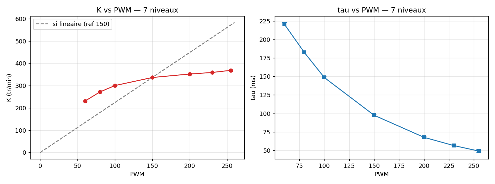

# dc-motor-cps-lab

**Cyber-physical bench for parametric identification of a brushed DC motor. A method, not a motor.**

First-year engineering side project (ENSGSI, 2025/2026): build a low-cost instrumented bench, acquire real data, identify validated models, document everything — including the failures.

## The bench

| Element | Reference |
|---|---|
| Motor + encoder | Pololu 37D 30:1, 64 CPR (POLOLU-4752) |
| Driver | Pololu VNH5019 (POLOLU-1451) |
| Controller | Arduino Uno R3 |
| Power | 12 V / 3 A (MEAN WELL GST36E12) |
| Acquisition | 100 Hz over serial (115200 baud), CSV |
| Analysis | Python (pandas, scipy, matplotlib), Jupyter |

## Repository structure

```
code/             Arduino sketches (direction test, square-wave logger)
data/             all datasets (CSV, one file per run) + campaign log
data/raw/         untouched serial-monitor exports (traceability)
docs/             results report, figures, build log
identification/   Jupyter notebooks (baseline analysis, full campaign)
```

## Method (S0 campaign)

Square-wave PWM excitation (2 s ON / 2 s OFF, 5 cycles per run), encoder response
logged at 100 Hz. Each rise is fitted with a first-order step response
v(t) = K(1 − e^(−t/τ)) by least squares. Model shapes for K(PWM) and τ(PWM) are
selected by leave-one-out cross-validation. Full details: [`docs/S0_bilan.md`](docs/S0_bilan.md).

## Key results (20 runs, 7 PWM levels, 90 fits)

- Day-to-day reproducibility: **0.9%** on K (within-run: < 1%)
- **K(PWM) = 369.2 (1 − e^(−PWM/60.6))** rpm — prediction error 3.9 rpm (leave-one-out)
- **τ(PWM) = 29.3 + 383.6 e^(−PWM/86.5)** ms — prediction error 1.2 ms
- Main finding: the actuator chain (driver in drive-coast PWM) is **strongly nonlinear**;
  a Hammerstein structure or operating-point linearization is retained for the sequel
- Manufacturer comparison: no-load speed measured **+12%** vs Pololu datasheet — under
  investigation (supply voltage, unit tolerance, ticks-per-rev check planned)



## Reproduce

1. Hardware: wiring in the sketch headers (`code/`)
2. Acquire: upload `code/stage5_logger/stage5_logger.ino`, Serial Monitor at **115200**,
   save output as `data/S0_pwmXXX_rN.csv`
3. Analyze: run `identification/02_campagne_S0.ipynb` — it ingests every
   `data/S0_pwm*.csv` automatically

## Roadmap

- [x] Bench build, wiring, soldering (see `docs/lab_notebook.html` for the honest version)
- [x] Direction + speed control (INB line debugged with multimeter)
- [x] S0 baseline: square-wave campaign, 7 levels, validated K/τ models
- [ ] Blind test PWM 115 (model predicts K = 314 rpm, τ = 131 ms)
- [ ] Resolve the +12% (VIN measurement, ticks-per-rev verification)
- [ ] Inertia J measurement (calculable added inertia on universal hub)
- [ ] S7: voltage/current identification, full physical model (J, B, Kt, Ke, R, L)

## Conventions

- One CSV = one run, named `S0_pwm{level}_r{repetition}.csv`
- Raw exports are archived untouched in `data/raw/`; cleaning is scripted, never manual
- Every run is logged in `data/campaign_log.md` (conditions, anomalies, open questions)
- Negative results are kept: documented failures are data
